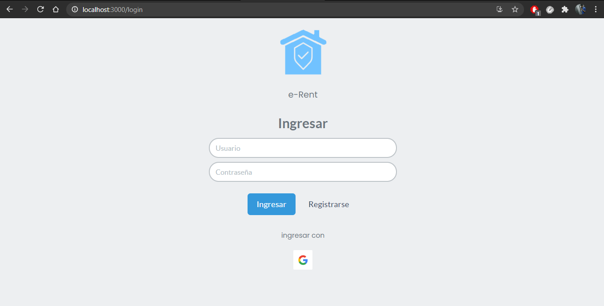

# e-rent
 

Este proyecto tiene como fin llevar el control de alquileres o rentas. Mantener al tanto al usuario de proximos vencimientos, generar recibos y enviarlos por correo, etc.
Como aun esta en pañales, las funciones estan siendo tratadas, codificadas e implementadas.

## Vista del login
 

Utilizo middlewares para restringir el acceso a posibles intrusos. Para acceder, implemente con firebase un sistema de loggeo rapido con google(en revision) y otro con usuario y contraseña.

## Vista inical
 
 
La vista inicial pretende dar accesibilidad, dejando a la mano funciones especificas. 
(Algunas vistas y funciones siguen tratandose)

# Vista inquilinos
 
 

## Formulario de registro de contrato/inquilino
 
 

# Vista de la factura generada
Detalle: La factura se genera automaticamente, implementando agenda. 
 
 

## Recibo en formato .pdf
Para crear el documento simplemente uso pdfkit, y los guardo en el storage de firebase. 
Detall: el enlace solo es valido por 60 minutos.
 
